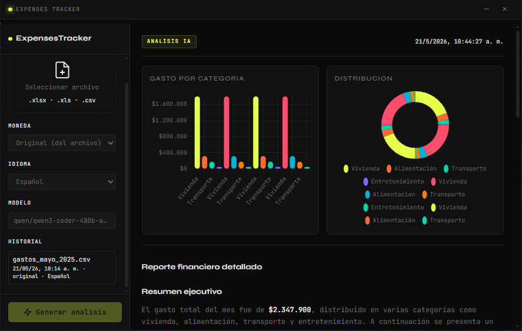

<p align="center">
  
  
  
  
  
  
  
  
</p>

# Expenses Tracker

<p align="center">
  
</p>

A desktop financial analysis application that reads expense data from Excel or CSV files, processes it through a Python backend, and sends it to an AI (Ollama or NVIDIA) to generate a financial analysis report with charts and history. The web interface runs embedded inside a native window via pywebview.

## Features

- **Excel & CSV support** — reads `.xlsx`, `.xls`, and `.csv` files with automatic encoding detection and delimiter sniffing
- **AI-powered analysis** — generates detailed financial reports in markdown via Ollama (local) or NVIDIA API (cloud)
- **Safe code execution** — AI can write and execute Python code inside a sandbox with AST whitelist, dunder protection, and threading timeout
- **Interactive charts** — bar and doughnut charts using Chart.js parsed directly from the AI report
- **Report history** — all generated reports are stored in SQLite and can be browsed, restored, or deleted
- **Statistical preview** — before generating, view column types, numeric summaries (min/max/avg/sum), and top categories
- **Configurable** — choose Ollama or NVIDIA backend, select language and currency per report
- **Debug mode toggle** — set `DEBUG_PRINTS=false` in `.env` to suppress all diagnostic output

## Architecture

```
Frontend (Vite + JS) → pywebview.api → Backend API → LLMClient → Ollama / NVIDIA API
                                                      → Sandbox (AST-safe code exec)
                                                      → SQLite (report history)
                                                      → Excel/CSV parser
```

The frontend never calls the LLM directly. All logic goes through the Python backend.

## Project Structure

```
backend/
├── core/
│   ├── api.py         # JS-exposed API (minimize, close, process_sheet, generate_report)
│   ├── llm.py         # LLMClient — abstracts Ollama and NVIDIA backends with configurable base URLs
│   ├── excel.py       # Excel/CSV parsing, encoding detection, delimiter sniffing, statistical summary
│   ├── sandbox.py     # AST-whitelisted sandbox for safe AI-generated code execution
│   ├── database.py    # SQLite CRUD for report history (init_db, save_report, get_history, etc.)
│   └── __init__.py
├── utils/
│   ├── helpers.py     # debug_print, center_window, get_gui, get_resource
│   └── __init__.py
├── main.py            # Entry point — loads .env, wires everything, creates pywebview window
src/                    # Frontend source (Vite + Tailwind)
```

## Technologies

- **Python 3.12** with pywebview (native window)
- **Vite** as the frontend bundler
- **Tailwind CSS v4** for styling
- **openpyxl** for Excel file parsing
- **Chart.js** for interactive charts
- **SQLite** for report history storage
- **LLM backends**: Ollama (local) or NVIDIA (cloud, via OpenAI-compatible API)
- **python-dotenv** for environment configuration

## Requirements

- Python 3.12
- Node.js 18+
- npm
- Ollama installed locally with a model pulled (only if `USE_OLLAMA=true`)
- NVIDIA API key (only if `USE_OLLAMA=false`)

### Linux only — system libraries

On Ubuntu or Debian-based distributions, pywebview on Linux requires Qt and additional system packages:

```bash
sudo apt update && sudo apt install -y \
    python3-dev \
    python3-pyqt5 \
    python3-pyqt5.qtwebengine \
    python3-sip \
    build-essential \
    libssl-dev \
    libcairo2-dev \
    libgirepository-2.0-dev \
    pkg-config
```

Then install the Python packages:

```bash
pip install pycairo PyGObject PyQt5 PyQtWebEngine bottle pythonnet314-whl
```

## Setup

### 1. Clone the repository

```bash
git clone https://github.com/melissagarridos/Expenses-Tracker
cd Expenses-Tracker
```

### 2. Create and activate a virtual environment

```bash
python -m venv venv
.\venv\Scripts\activate   # Windows
source venv/bin/activate  # macOS / Linux
```

### 3. Install Python dependencies

```bash
pip install -r requirements.txt
```

**Linux only** — additional system packages and PyQt5 (see [Linux requirements](#linux-only--system-libraries) above).

### 4. Install frontend dependencies

```bash
npm install
```

### 5. Configure environment

```bash
cp .env.example .env
```

Edit `.env` with your settings. All available variables are documented in `.env.example`:

| Variable | Description | Default |
|---|---|---|
| `APP_NAME` | Window title | `ExpensesTracker` |
| `APP_VERSION` | App version | `1.0.0` |
| `DEV_MODE` | Use Vite dev server (`true`) or production build (`false`) | `true` |
| `DEV_URL` | Vite dev server URL | `http://localhost:5173` |
| `USE_OLLAMA` | Use Ollama (`true`) or NVIDIA (`false`) | `true` |
| `OLLAMA_MODEL` | Ollama model name | `phi3` |
| `OLLAMA_BASE_URL` | Ollama API base URL | `http://localhost:11434` |
| `NVIDIA_API_KEY` | NVIDIA API key (required if `USE_OLLAMA=false`) | — |
| `NVIDIA_MODEL` | NVIDIA model name | `qwen/qwen3-coder-480b-a35b-instruct` |
| `NVIDIA_BASE_URL` | NVIDIA API base URL | `https://integrate.api.nvidia.com/v1` |
| `DEBUG_PRINTS` | Show diagnostic prints in terminal | `true` |

### 6. Pull the Ollama model (optional)

Only if you plan to use Ollama:

```bash
ollama pull phi3
```

## Development

Run both processes in separate terminals:

```bash
# Terminal 1 — Vite dev server
npm run dev

# Terminal 2 — pywebview window
python main.py
```

## Production

```bash
npm run build
python main.py  # set DEV_MODE=false in .env first
```

## Scripts

| Command | Description |
|---|---|
| `npm run dev` | Start the Vite development server |
| `npm run build` | Build for production into `interface/` |
| `npm run preview` | Preview the production build |
| `python main.py` | Launch the desktop window |

## Notes

- If using Ollama, it must be running at `http://localhost:11434` before generating reports.
- If using NVIDIA, set `USE_OLLAMA=false` in `.env` and provide your `NVIDIA_API_KEY`.
- Models and API base URLs are configurable via `.env` (`OLLAMA_MODEL`, `NVIDIA_MODEL`, `OLLAMA_BASE_URL`, `NVIDIA_BASE_URL`).
- Set `DEBUG_PRINTS=false` in `.env` to suppress terminal diagnostic output.
- In development, pywebview points to `http://localhost:5173`. In production, it loads the build from `interface/`.
